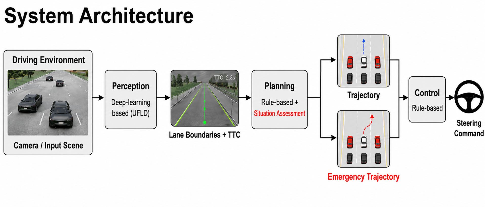
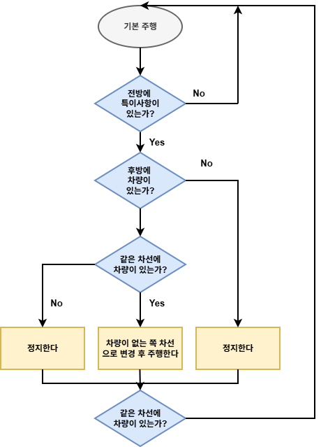
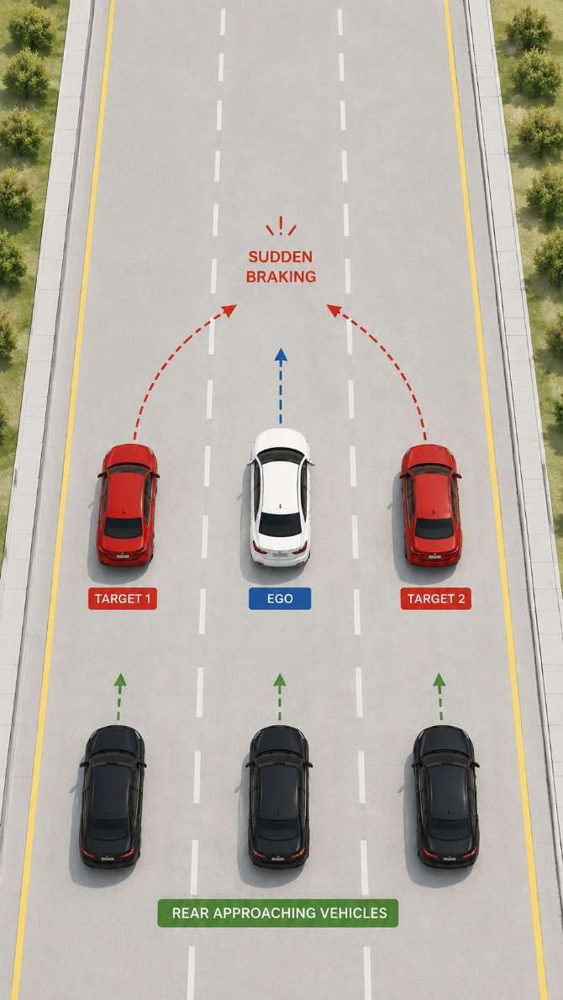
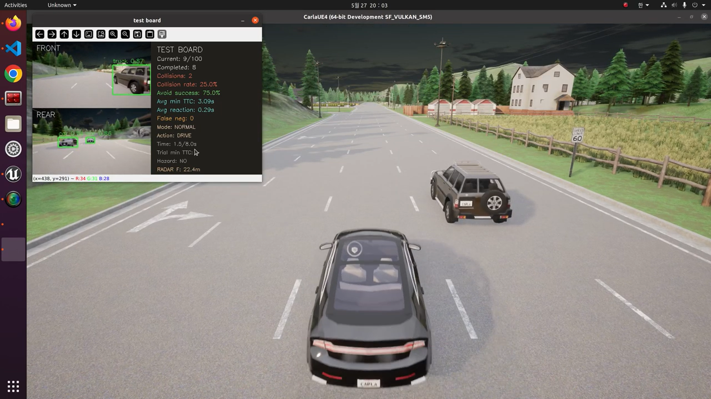
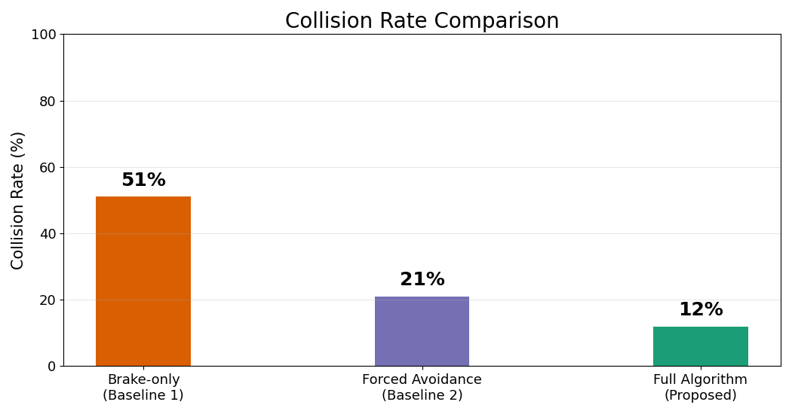
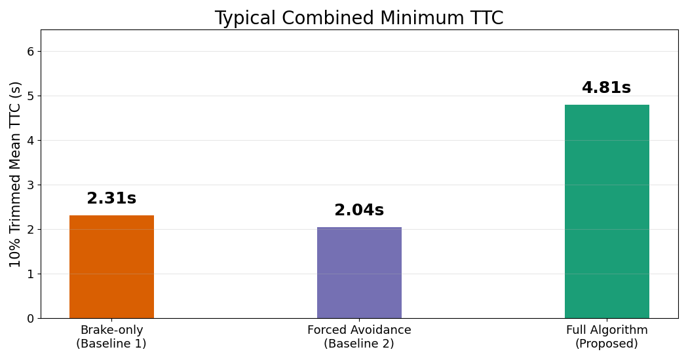
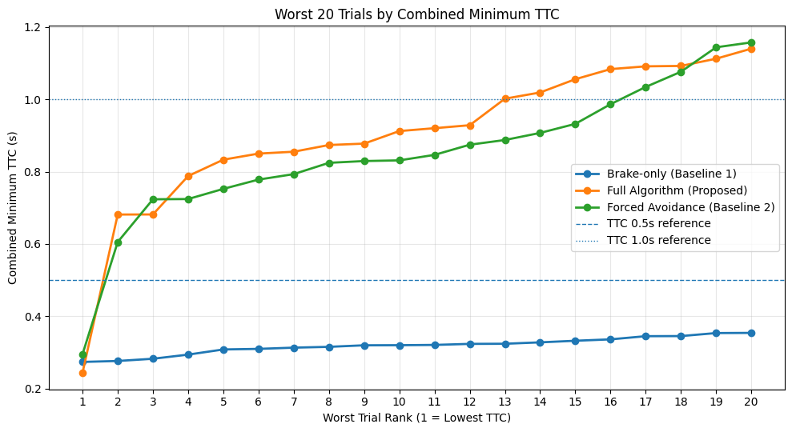

# 차량 유사시 행동상태 알고리즘 개발

국민대학교 미래자동차 다학제간 캡스톤 디자인 프로젝트 (팀명: Tmo)

CARLA + ROS2 환경에서, 전방 차량의 끼어들기(Cut-in) 및 급제동 상황과 후방 차량의 접근을 동시에 고려해 최적의 회피 기동을 선택하는 자율주행 유사시 판단 알고리즘을 설계·검증합니다.

---

## 프로젝트 배경

기존 ADAS/ACC 시스템은 전방 위험만을 기준으로 긴급 제동(AEB)을 수행할 뿐, 후방 차량과의 충돌 가능성은 고려하지 않습니다. NHTSA 보고서에 따르면 후방추돌은 전체 교통사고의 약 29%를 차지하는 가장 빈번한 사고 유형이며, 사고 관련 운전자의 47%가 선행 차량 제동 감지 후 약 2초 이내에 반응하지 못합니다. 또한 ACC 사용 중 고속도로 사고는 최근 6년간 573% 증가했습니다.

기존 양산 시스템(KIA-FCA, Subaru-eyesight AES 등)이 가진 한계는 다음과 같습니다.

- 긴급 제동 시 후방 차량과의 충돌을 고려하지 않음
- 끼어들기 상황에 대한 능동적 회피 로직 부재
- 전·후방 위험을 통합적으로 판단하는 의사결정 로직 부재 (후방 차량이 있을 때의 급제동은 오히려 위험할 수 있음)

---

## 프로젝트 목표

전·후방 위험을 동시에 고려하여 단순 제동과 회피 기동 중 최적의 행동을 선택하는 지능형 유사시 상황 판단 알고리즘을 개발하고, CARLA 시뮬레이션 기반의 정량적 지표(충돌률, 최소 TTC)로 실효성을 검증합니다.

---

## 시스템 아키텍처

인지(Perception) → 판단(Decision) → 제어(Control)로 구성된 모듈러 아키텍처입니다.



| 모듈 | 구성 | 역할 |
| --- | --- | --- |
| **Perception** | UFLD v2(차선 인식), YOLO v8(객체 인식) | 센서 데이터 전처리 및 융합 |
| **Decision** | TTC 기반 위험 상황 평가 | 점수제 기반 최적 행동 선택, 비상 경로(Emergency Trajectory) 생성 |
| **Control** | PID 제어 | 조향/가감속, 차량 동역학 모델 반영 |

| 구분 | 상세 구성 |
| --- | --- |
| Middleware | Linux 기반 ROS2 Galactic |
| Simulator | CARLA Simulator (Town06_opt Map) |
| Scenario Tool | CARLA Scenario Runner (Cut-in 시나리오 구현) |

---

## 유사시 판단 알고리즘

전·후방 위험도를 TTC(Time To Collision)로 정량화한 뒤, 아래 매트릭스에 따라 최적 행동을 결정합니다. 최종적으로 인접 차선의 점유 상태를 확인해 좌/우 회피 가능 여부를 판단합니다.

```
TTC = Distance / Relative Velocity
```

| 상황 조건 | 판단 결과 | 수행 동작 |
| --- | --- | --- |
| 전방 TTC < 2.0s, 후방 안전 | 전방 위험 | 긴급 제동 (AEB) |
| 전방 TTC < 2.0s, 후방 TTC < 1.5s | 복합 위험 | 능동 회피 기동 |
| 전방 TTC > 3.0s | 정상 주행 | 속도 유지 (ACC) |

판단 로직을 단순화하면 아래 순서도와 같습니다 (전방 특이사항 → 후방 차량 유무 → 같은 차선 점유 여부 순으로 확인해 제동/차선 변경을 결정).



---

## 실험 시나리오 및 검증 방법

Euro NCAP CCRB(Car-to-Car Rear Braking) 시나리오를 참고해 구성했습니다.



- **Ego 차량**(흰색): 50.4 km/h 정속 주행
- **Target 차량**(빨간색): 전방 20 m 지점에서 끼어든 뒤 급제동
- **Rear 차량**(검정색, 최대 2대): 60.4 km/h, 차간거리 12~24 m로 좌/우/동일 차선에 랜덤 생성되어 Ego 차량 후방에서 접근

CARLA 상에서 전·후방 카메라 뷰와 실시간 판단 지표(충돌률, 평균 최소 TTC 등)를 함께 모니터링하며 검증했습니다.



아래 세 조건을 각 100회씩 반복 실험했습니다.

| 비교군 | 행동 방식 |
| --- | --- |
| 비교군 1 (단순 정지) | Brake-only |
| 비교군 2 (단순 회피) | 좌/우 차선 변경(Forced Avoidance) |
| 제안 알고리즘 | 후방을 고려한 주행 선택(Full Algorithm) |

평가 지표: 충돌률(Collision Rate), 최소 TTC(Min TTC), 평균 감속도(Avg Deceleration)

---

## 프로젝트 수행 결과

<p float="left">
  
  
</p>

- **충돌률**: 제안 알고리즘 12% vs 단순 제동(51%) 대비 76.5% 감소, 단순 회피(21%) 대비 42.9% 감소
- **평균 TTC**: 제안 알고리즘 4.81s로 단순 제동(2.31s) 대비 2.08배, 단순 회피(2.04s) 대비 2.36배 향상



- **Worst 20 시나리오**: 가장 위험한 상위 20개 사례에서도 제안 알고리즘은 전 구간 TTC 0.5s 기준선을 상회(충돌 회피)한 반면, 단순 제동은 전 구간에서 0.5s 미만으로 상시 충돌 위험 상태

세 가지 지표 모두에서 제안 알고리즘이 개선된 성능을 보였으며, 후방 추돌 위험을 효과적으로 회피했습니다.

---

## 기대효과 및 향후 과제

- ADAS 시스템 고도화: 양산차 AEB에 후방 상황 인지·능동 회피 로직을 결합해 지능형 안전 보조 장치로 발전
- 특수 상황 대응: 후방에서 고속 접근하는 긴급차량에 대한 능동적 양보/회피 시스템으로 확장 가능
- 향후 과제: 더 다양한 유사시 시나리오 검증, 시뮬레이션을 넘어선 실차 환경 검증 필요

---

## 레포지토리 구성

`src/carla_agent` — CARLA 환경에서 전·후방 통합 위험 판단 및 회피 기동을 수행하는 ROS2 패키지

- `carla_agent/autopilot_node.py` — TTC 기반 전·후방 위험 평가 및 긴급 제동/회피 기동 판단
- `carla_agent/vehicle_spawner.py` — CARLA 내 Ego/Target/Rear 차량 스폰
- `carla_agent/object_detector.py` — YOLO 기반 객체 인식
- `carla_agent/lane_detect.py`, `lane_follower.py` — UFLD v2 기반 차선 인식 및 차선 추종
- `carla_agent/spectator_follower.py` — CARLA 관전 시점(spectator) 추종
- `carla_agent/visualizer.py` — 주행/위험 평가 시각화
- `launch/carla_agent.launch.py` — ROS2 런치 설정

## 빌드

```bash
source /opt/ros/galactic/setup.bash
colcon build --packages-select carla_agent
source install/setup.bash
```

빌드 산출물은 버전 관리에서 제외됩니다.

---

## Contributors

- **조윤진** (팀장) — 전체 시스템 통합, CARLA 시뮬레이션 환경 구축
- **원대호** (팀원) — YOLO 객체 인식, 긴급 상황 시나리오 설계
- **최정윤** (팀원) — UFLD v2 차선 인식, PID 제어 구현
