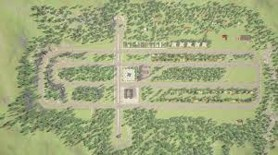
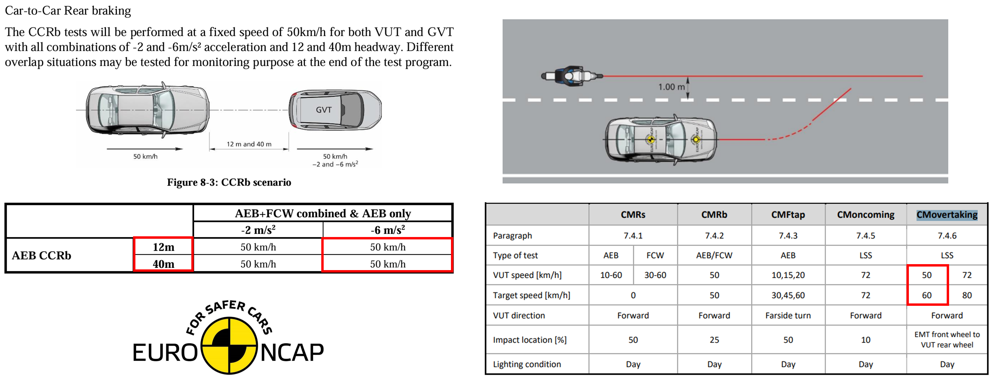
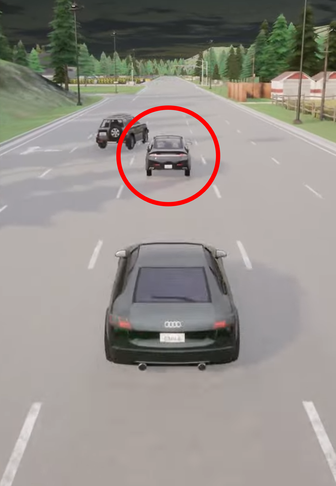
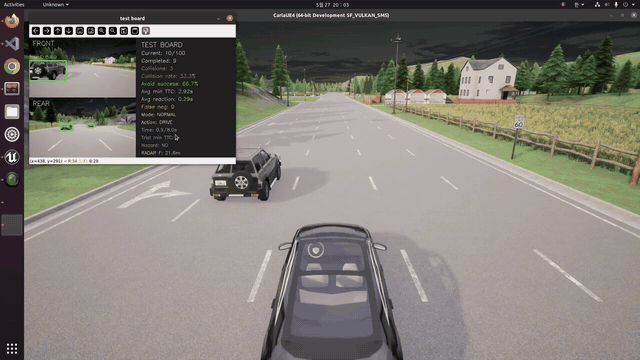
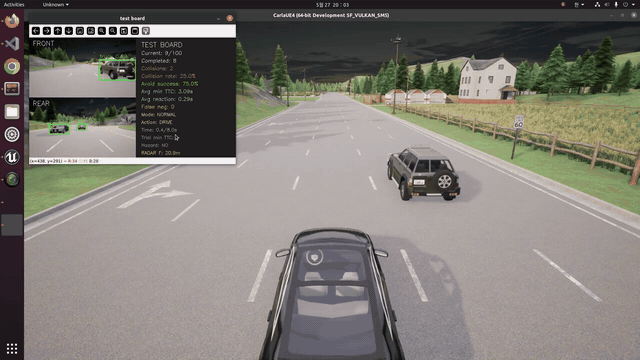

# Vehicle Emergency Behavior-State Algorithm Development

Kookmin University Future Mobility Multidisciplinary Capstone Design Project (Team: Tmo)

In CARLA + ROS2, this project designs and validates an autonomous-driving emergency decision algorithm that selects the optimal avoidance maneuver by simultaneously considering a cut-in / hard-braking situation ahead and an approaching vehicle behind.

---

## Background

Existing ADAS/ACC systems perform emergency braking (AEB) based solely on front-side risk, without considering the possibility of a collision with a vehicle behind. According to an NHTSA report, rear-end collisions account for about 29% of all traffic accidents — the most frequent accident type — and 47% of drivers involved fail to react within about 2 seconds of detecting the lead vehicle's braking. Highway accidents during ACC use have also increased 573% over the past six years.

Existing production systems (KIA-FCA, Subaru-eyesight AES, etc.) share the following limitations:

- They don't consider a collision with a rear vehicle during emergency braking
- They lack active avoidance logic for cut-in situations
- They lack decision logic that integrates front and rear risk (hard braking when a rear vehicle is present can itself be dangerous)

---

## Goal

Develop an intelligent emergency decision algorithm that considers front and rear risk simultaneously to choose the optimal action between simple braking and an avoidance maneuver, and validate its effectiveness using quantitative CARLA-simulation metrics (collision rate, minimum TTC).

---

## System Architecture

A modular architecture composed of Perception → Decision → Control.

| Module | Components | Role |
| --- | --- | --- |
| **Perception** | UFLD v2 (lane detection), YOLO v8 (object detection) | Sensor data preprocessing and fusion |
| **Decision** | TTC-based risk assessment | Score-based optimal action selection, Emergency Trajectory generation |
| **Control** | PID control | Steering / acceleration-deceleration, reflects vehicle dynamics model |

| Category | Configuration |
| --- | --- |
| Middleware | ROS2 Galactic on Linux |
| Simulator | CARLA Simulator (Town06_opt Map) |
| Scenario Tool | CARLA Scenario Runner (Cut-in scenario implementation) |



---

## Emergency Decision Algorithm

Front and rear risk are quantified as TTC (Time To Collision), and the optimal action is determined using the matrix below. The final step checks whether the adjacent lane is occupied to determine whether a left/right avoidance maneuver is possible.

```
TTC = Distance / Relative Velocity
```

| Condition | Judgment | Action |
| --- | --- | --- |
| Front TTC < 2.0s, rear safe | Front risk | Emergency braking (AEB) |
| Front TTC < 2.0s, rear TTC < 1.5s | Combined risk | Active avoidance maneuver |
| Front TTC > 3.0s | Normal driving | Maintain speed (ACC) |

A simplified version of the decision logic is shown in the flowchart below (checked in order: anything unusual ahead → vehicle present behind → same lane occupied → brake / change lane).


---

## Experimental Scenarios and Validation Method

The test scenario is based on the Euro NCAP CCRB (Car-to-Car Rear Braking) protocol.



*Reference: CCRb (Car-to-Car Rear braking) scenario and speed criteria from the Euro NCAP AEB test protocol*



- **Ego vehicle** (the vehicle marked with the red circle): drives at a constant 50.4 km/h
- **Target vehicle** (the vehicle ahead of the Ego vehicle): cuts in 20 m ahead, then brakes suddenly
- **Rear vehicle(s)** (the vehicle(s) behind the Ego vehicle, up to 2): drive at 60.4 km/h, spawned randomly 12–24 m behind in the left/right/same lane, approaching the Ego vehicle from the rear

Validation was performed in CARLA while monitoring both front/rear camera views and real-time decision metrics (collision rate, average minimum TTC, etc.).


| Scenario 1 | Scenario 2 |
| --- | --- |
|  |  |

The following three conditions were each tested over 100 trials.

| Comparison Group | Behavior |
| --- | --- |
| Baseline 1 (Brake-only) | Brake-only |
| Baseline 2 (Forced Avoidance) | Lane change left/right (Forced Avoidance) |
| Proposed Algorithm | Driving decision that accounts for the rear (Full Algorithm) |

Evaluation metrics: Collision Rate, Minimum TTC (Min TTC), Average Deceleration (Avg Deceleration)

---

## Results

<p float="left">
  
  
</p>

- **Collision rate**: the proposed algorithm reached 12%, a 76.5% reduction versus Brake-only (51%) and a 42.9% reduction versus Forced Avoidance (21%)
- **Average TTC**: the proposed algorithm reached 4.81s, 2.08× Brake-only (2.31s) and 2.36× Forced Avoidance (2.04s)


- **Worst 20 scenarios**: even in the 20 most dangerous cases, the proposed algorithm stayed above the 0.5s TTC threshold throughout (avoiding collision), while Brake-only stayed below 0.5s throughout — a constant collision-risk state

The proposed algorithm showed improved performance across all three metrics and effectively avoided rear-end collision risk.

---

## Expected Impact and Future Work

- ADAS upgrade: combining rear-situation awareness and active-avoidance logic with production-vehicle AEB to evolve it into an intelligent safety-assist system
- Special-situation response: extendable to an active yielding/avoidance system for a fast-approaching emergency vehicle from the rear
- Future work: validating a wider range of emergency scenarios, and validation in a real-vehicle environment beyond simulation

---

## Repository Structure

`src/carla_agent` — a ROS2 package that performs integrated front/rear risk judgment and avoidance maneuvers in the CARLA environment

- `carla_agent/autopilot_node.py` — TTC-based front/rear risk assessment and emergency-braking/avoidance-maneuver decision
- `carla_agent/vehicle_spawner.py` — spawns the Ego/Target/Rear vehicles in CARLA
- `carla_agent/object_detector.py` — YOLO-based object detection
- `carla_agent/lane_detect.py`, `lane_follower.py` — UFLD v2-based lane detection and lane following
- `carla_agent/spectator_follower.py` — follows the CARLA spectator viewpoint
- `carla_agent/visualizer.py` — visualizes driving/risk assessment
- `launch/carla_agent.launch.py` — ROS2 launch configuration

## Build

```bash
source /opt/ros/galactic/setup.bash
colcon build --packages-select carla_agent
source install/setup.bash
```

Build artifacts are excluded from version control.

---

## Contributors

- **[Yoonjin Cho](https://github.com/gerrard088)** (Team Lead) — overall system integration, CARLA simulation environment setup
- **[Daeho Won](https://github.com/1daymore)** (Member) — YOLO object detection, emergency scenario design
- **[Jeongyun Choi](https://github.com/choijeongyun12)** (Member) — UFLD v2 lane detection, PID control implementation
